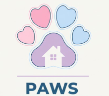

# 🐾 PAWS — Pets Management Platform

<div align="center">



**Connecting pet owners with pet care in Medellín, Colombia**

[](https://paws-app-bjfydtcsh6g4djcg.centralus-01.azurewebsites.net/)
[](https://nodejs.org)
[](https://postgresql.org)

</div>

---

## Table of Contents

- [Overview](#overview)
- [Features](#features)
- [Tech Stack](#tech-stack)
- [Getting Started](#getting-started)
- [Dependencies](#dependencies)
- [Environment Variables](#environment-variables)
- [Database Setup](#database-setup)
- [Running with Docker](#running-with-docker)
- [API Reference](#api-reference)
- [Project Structure](#project-structure)
- [Team](#team)

---

## Overview

PAWS is a full-stack **Single Page Application (SPA)** that bridges the gap between pet owners and veterinary businesses in Medellín. The platform enables:

- Pet owners to manage their animals, book appointments, and access AI-powered health guidance.
- Veterinary clinics to manage their business profile, appointments, and patient records.
- Administrators to oversee all registered users, pets, and businesses.

> Built as the final integrative project for the **RIWI Basic Route** program, following SCRUM methodology with Azure DevOps.

---

## Features

### For Pet Owners
- Register and log in with email/password or Google OAuth
- Create and manage pet profiles (species, breed, age, weight)
- Book veterinary appointments at registered clinics
- View full appointment history with real-time status
- Access complete medical records per pet
- AI symptom triage — get urgency classification (HIGH / MEDIUM / LOW)
- AI care tips personalized to your pet's profile

### For Veterinary Businesses
- Register clinic with NIT verification
- Manage appointment requests (confirm, cancel, complete)
- Create and update medical records for patients
- Configure business profile, schedule and services

### AI Features (Google Gemini)
- **Symptom Triage**: Classifies urgency based on species and symptoms
- **Clinic Recommendation**: Suggests top 3 clinics matching the symptoms
- **Care Tips**: Returns 5 personalized tips (cached 24h)

### Discovery
- Interactive map with all registered clinics (Google Maps API)
- Search and filter by zone, specialty, services, 24h availability
- Emergency module with direct WhatsApp links to 24/7 clinics

---

## Tech Stack

| Layer | Technology |
|-------|-----------|
| Frontend | Vanilla JavaScript ES6+, HTML5, CSS3 |
| Styling | Tailwind CSS (CDN) |
| Backend | Node.js 18+ / Express.js 4 |
| Database | PostgreSQL 14+ |
| Authentication | JWT + Google OAuth 2.0 (Passport.js) |
| AI | Google Gemini 2.5 Flash |
| Chatbot | n8n |
| Email | Nodemailer |
| Containers | Docker + Docker Compose |
| Deployment | Azure App Service + Azure Container Registry |

---

## Getting Started

### Prerequisites

- Node.js 18 or higher
- PostgreSQL 14 or higher
- npm (comes with Node.js)

### 1. Clone the repository

```bash
git clone https://github.com/[your-org]/PAWS-develop.git
cd PAWS-develop
```

### 2. Install dependencies

```bash
npm install
```

This single command installs all packages listed in `package.json`. See the [Dependencies](#dependencies) section for a full breakdown of what each package does.

### 3. Configure environment variables

```bash
cp .env.example .env
```

Edit `.env` with your credentials (see [Environment Variables](#environment-variables)).

### 4. Set up the database

```bash
# Connect to PostgreSQL and run the schema
psql -U postgres -c "CREATE DATABASE paws_db;"
psql -U postgres -d paws_db -f database/db.sql
```

### 5. Start the development server

```bash
npm run dev      # with nodemon (auto-reload)
# or
npm start        # without auto-reload
```

The app will be available at **http://localhost:3000**

---

## Dependencies

All dependencies are managed via `package.json` and installed with `npm install`.

### Production dependencies

| Package | Version | What it does |
|---------|---------|--------------|
| `express` | ^4.18.2 | The web framework. Handles all HTTP routes, middleware and responses. The backbone of the entire backend. |
| `pg` | ^8.11.3 | PostgreSQL client for Node.js. Provides the connection pool (`Pool`) that executes all SQL queries against the database. |
| `dotenv` | ^16.6.1 | Loads the `.env` file into `process.env` at startup. Keeps all secrets out of the source code. |
| `jsonwebtoken` | ^9.0.3 | Creates and verifies JWT tokens. Used for the access token (15 min) and refresh token (7 days) in the authentication flow. |
| `bcryptjs` | ^3.0.3 | Hashes passwords before saving them to the database. Also used to compare a plain-text password against its hash during login — without ever decrypting it. |
| `bcrypt` | ^6.0.0 | Same purpose as bcryptjs but uses a native C++ binding (faster). Both are present in the project; bcryptjs is the one actively used in `authStorage.js`. |
| `cookie-parser` | ^1.4.7 | Parses cookies from incoming requests. Required so Express can read the `access_token` and `refresh_token` httpOnly cookies sent by the browser. |
| `cors` | ^2.8.5 | Adds the `Access-Control-Allow-Origin` header. Allows the frontend (running in the browser) to make requests to the backend API. |
| `express-session` | ^1.18.1 | Session middleware required by Passport.js to maintain the OAuth state during Google login. |
| `passport` | ^0.7.0 | Authentication middleware. Manages the Google OAuth 2.0 strategy and integrates with Express sessions. |
| `passport-google-oauth20` | ^2.0.0 | The Google-specific OAuth 2.0 strategy for Passport. Handles the redirect to Google, receives the user profile, and returns it to the callback. |
| `@google/generative-ai` | ^0.24.1 | Official Google SDK for the Gemini API. Used for symptom triage, clinic recommendations, care tips, and medical record extraction from PDFs. |
| `nodemailer` | ^8.0.2 | Sends emails via SMTP. Used by the contact form to deliver messages to the PAWS team via Gmail. |
| `multer` | ^2.1.1 | Handles `multipart/form-data` file uploads. Used in the medical records module to receive PDF and image files from the frontend. |
| `groq-sdk` | ^1.1.1 | SDK for the Groq API. Powers the PAWS chatbot (fast LLM inference). |
| `@n8n/chat` | ^1.11.2 | Embeds the n8n chat widget in the frontend. Provides the chatbot UI that connects to the n8n workflow automation backend. |

### Dev dependencies

| Package | Version | What it does |
|---------|---------|--------------|
| `nodemon` | ^3.1.14 | Watches for file changes and automatically restarts the Node.js server during development. Only used with `npm run dev` — not included in the production Docker image. |

> **Note:** `nodemon` is listed under `devDependencies` and is excluded from the Docker production build via `npm install --omit=dev` in the Dockerfile.

---

## Environment Variables

Create a `.env` file in the root of the project:

```env
# ── Database ──────────────────────────────────────
DB_HOST=localhost
DB_PORT=5432
DB_NAME=paws
DB_USER=postgres
DB_PASSWORD=your_postgres_password
DB_SSL=false

# ── Server ────────────────────────────────────────
PORT=3000
NODE_ENV=development
APP_URL=http://localhost:3000

# ── Authentication ────────────────────────────────
JWT_SECRET=your_jwt_secret_here
REFRESH_SECRET=your_refresh_secret_here
SESSION_SECRET=your_session_secret_here

# ── Google OAuth ──────────────────────────────────
GOOGLE_CLIENT_ID=your_google_client_id
GOOGLE_CLIENT_SECRET=your_google_client_secret
GOOGLE_CALLBACK_URL=http://localhost:3000/auth/google/callback

# ── AI (Google Gemini) ────────────────────────────
GEMINI_API_KEY=your_gemini_api_key

# ── Email (Nodemailer / Gmail) ────────────────────
GMAIL_USER=your_email@gmail.com
GMAIL_APP_PASSWORD=your_gmail_app_password

# ── Maps ──────────────────────────────────────────
GOOGLE_MAPS_API_KEY=your_google_maps_api_key

# ── Chatbot (Groq) ────────────────────────────────
GROQ-PAWS-CHATBOT=your_groq_api_key
```

> **Never commit `.env` to the repository.** It is already listed in `.gitignore` and `.dockerignore`.
>
> For production on Azure, set these values in **App Service → Configuration → Application Settings** instead of using a `.env` file.

---

## Database Setup

The database schema is in `database/db.sql`. It creates 26 tables covering:

- **Identity**: `users`, `refresh_tokens`
- **Businesses**: `businesses`, `clinics`, `vets`, `petshops`, `dog_walkers`, `daycares`, `shelters`
- **Catalogs**: `specialties`, `animal_types`, `schedules`
- **Pet Management**: `pets`, `medical_records`, `adoptions`, `shelter_pets`
- **Operations**: `appointments`, `daycare_slots`, `daycare_bookings`, `reviews`
- **Emergency**: `emergencies`, `emergency_messages`

The ER diagram is available at `database/ER_Diagram.png`.

To apply the latest migration:

```bash
psql -U postgres -d paws_db -f database/migration_v3.sql
```

---

## Running with Docker

```bash
# Build and start both the app and PostgreSQL
docker-compose up --build

# Stop containers
docker-compose down
```

The app will be available at **http://localhost:3000**

For Azure deployment instructions, see [`docs/docker-azure.md`](./docs/docker-azure.md).

---

## API Reference

All API endpoints are prefixed with `/api`.

| Module | Base Path | Description |
|--------|-----------|-------------|
| Auth | `/api/auth` | Login, register, logout, Google OAuth |
| Users | `/api/users` | User CRUD, dashboard, appointments |
| Pets | `/api/pets` | Pet CRUD, query by user |
| Businesses | `/api/businesses` | Business CRUD, specialties, schedule |
| Appointments | `/api/appointments` | Create, update, status management |
| Medical Records | `/api/medical-records` | Create, update, query by pet |
| Emergencies | `/api/emergencies` | Emergency events |
| AI | `/api/ai` | Triage, clinic recommendation, care tips |
| Contact | `/api/contact` | Send contact email |

---

## Project Structure

```
PAWS-develop/
├── index.html                  # SPA entry point
├── backend/
│   ├── app.js                  # Express app + route registration
│   ├── db.js                   # PostgreSQL connection pool
│   ├── routes/                 # Route definitions (9 modules)
│   ├── controllers/            # Business logic layer
│   ├── storage/                # Data access layer (SQL queries)
│   ├── services/               # Email, AI integrations
│   └── middleware/             # Auth, validation, error handling
├── frontend/
│   ├── src/
│   │   ├── router/             # Hash-based SPA router
│   │   ├── views/              # Page components (19 views)
│   │   ├── components/         # Shared UI components
│   │   ├── services/           # API client layer (api.js)
│   │   └── styles/             # CSS files per view
│   └── assets/                 # Images, fonts, icons
├── database/
│   ├── db.sql                  # Full schema
│   ├── migration_v3.sql        # Latest migration
│   ├── ER_Diagram.png          # Entity-relationship diagram
│   └── UML_Veterinary.png      # UML class diagram
├── docs/
│   ├── docker-azure.md         # Azure deployment guide
│   └── dependencias.md         # Dependency notes
├── Dockerfile
├── package.json
└── .env.example
```

---

## Team

| Name | Role | GitHub |
|------|------|--------|
| Ulith Giraldo Echavarría | Scrum Master / Backend Lead | [@UlithG18](https://github.com/UlithG18) |
| Andreina Arevalo Pidiache | Product Owner / Frontend Lead | [@NinaArevalo](https://github.com/NinaArevalo) |
| Faiber Andres Camacho Regino | Developer / AI Integration | [@FaiberCamachoDev](https://github.com/FaiberCamachoDev) |
| Anderson Guzman Ochoa | Developer / General Features | [@andguz8a](https://github.com/andguz8a) |
| Jose Miguel Rivera Quiroz | Developer / Admin Features | [@JoseRivera-07](https://github.com/JoseRivera-07) |
| Ximena Jaramillo Cardenas | Developer / Data Base & Deployment | [@Jaramc](https://github.com/Jaramc) |

> RIWI Basic Route — Cohorte 6 — Medellín, Colombia